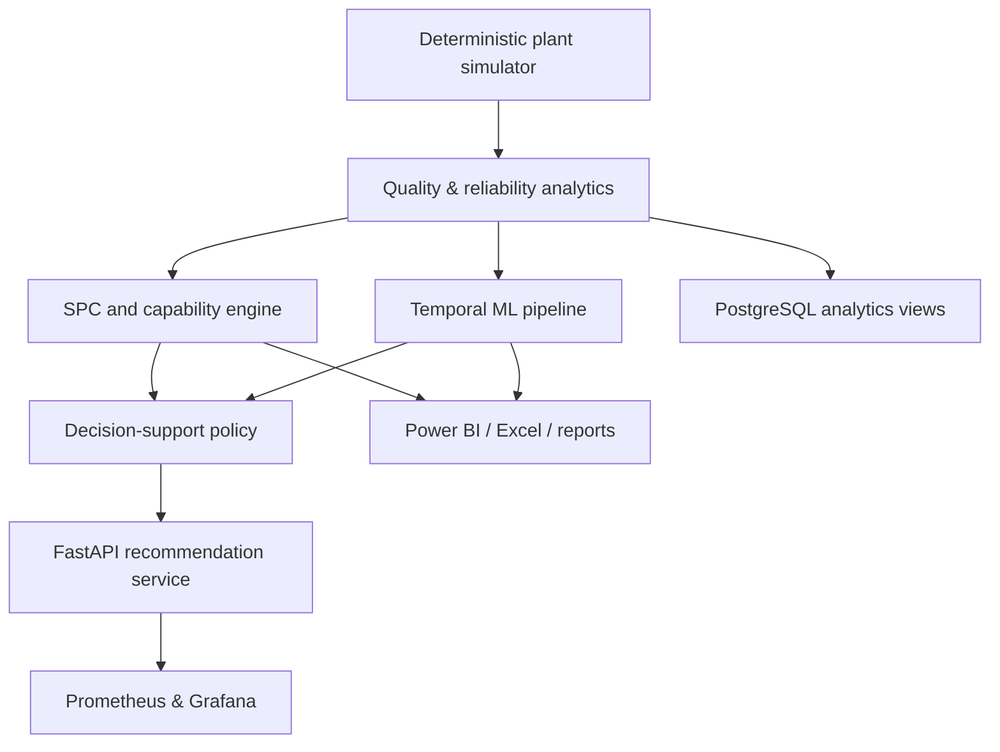

# Manufacturing Quality, OEE & Predictive Maintenance Control Tower

[](https://github.com/muratmiracg-dev/Manufacturing-Quality-OEE-Predictive-Maintenance-Control-Tower/actions/workflows/ci.yml)
[](https://github.com/muratmiracg-dev/Manufacturing-Quality-OEE-Predictive-Maintenance-Control-Tower/actions/workflows/codeql.yml)
[](https://github.com/muratmiracg-dev/Manufacturing-Quality-OEE-Predictive-Maintenance-Control-Tower/actions/workflows/security.yml)
[](coverage.xml)
[](docs/data_contract.md)
[](docs/adr/003-recommendation-only.md)

An end-to-end manufacturing analytics portfolio platform that combines OEE,
downtime, reliability, quality, SPC, process capability and explainable
predictive maintenance. Every result below was produced by the deterministic
pipeline from fully synthetic plant data; no production, employee, customer or
maintenance-order data is present.

> **Safety and operating boundary:** the API returns recommendations only. It
> cannot stop equipment, create work orders or approve maintenance. A qualified
> human remains accountable for every operational decision.

## Verified pipeline snapshot

The committed snapshot uses seed `20260729`, 4 lines, 12 machines, 4 products,
3 shifts and 18 months of synthetic history.

| Area | Verified result |
|---|---:|
| Production shifts / CTQ measurements | 19,692 / 98,460 |
| Total synthetic output | 19,581,400 units |
| Availability / Performance / Quality | 98.36% / 90.99% / 95.27% |
| Plant OEE | **85.27%** |
| First-pass yield | 95.27% |
| Scrap / Rework rate | 1.99% / 2.75% |
| Synthetic Cost of Poor Quality | 12,936,905.5 cost units |
| MTBF / MTTR | 145.96 h / 1.73 h |
| Champion / Challenger | Random Forest / Logistic Regression |
| OOT ROC-AUC / PR-AUC | 0.7489 / 0.3887 |
| OOT Brier / ECE | 0.1137 / 0.0164 |
| OOT Precision / Recall | 26.30% / 73.51% |
| Validation-selected threshold | 0.1478 |
| OOT alarm rate / median lead time | 43.11% / 16 h |
| Tests / coverage | 35 passed / **95.30%** |

PR-AUC should be read against the OOT positive rate of 15.43%; the achieved
0.3887 is approximately 2.52x the no-skill baseline. The OOT alarm rate exceeds
the validation capacity cap of 40%, which is intentionally surfaced as a
monitoring finding rather than hidden.

## Architecture



The architecture and its trust boundaries are documented in
[docs/architecture.md](docs/architecture.md).

## Analytical scope

- OEE components use ratio-of-sums aggregation: Availability x Performance x
  Quality.
- Downtime separates planned and unplanned events, then provides Pareto,
  production-loss cost and failure-mode views.
- MTBF and MTTR are calculated from observed synthetic operating and repair
  hours.
- Quality covers scrap, rework, FPY and internal Cost of Poor Quality.
- X-bar/R is used for fixed `n=5` rational CTQ subgroups.
- I-MR is used for one surface-roughness observation per shift.
- p charts use varying inspected lot sizes; u charts use varying unit counts.
- np and c charts are not selected because constant-size assumptions do not
  hold for this generated process.
- Control limits estimate baseline process behavior. LSL/USL remain separate
  engineering specification limits used for Cp, Cpk, Pp and Ppk.

The exact alarm rules and chart-selection rationale are in
[docs/spc_methodology.md](docs/spc_methodology.md).

## Predictive-maintenance governance

- Target: failure in the next 24 hours.
- Split: chronological development, later validation and final out-of-time
  test.
- Leakage control: 24-hour purge gaps at split boundaries; only information
  available at the pre-shift decision point is modeled.
- Imbalance: candidate-specific class weighting.
- Calibration: sigmoid calibration on a later internal development window.
- Model selection: validation-only discrimination and calibration score.
- Threshold: validation-only asymmetric cost optimization with minimum 72%
  recall and maximum 40% review-capacity constraints.
- Explainability: global and local SHAP values for the champion base estimator;
  the probability-calibration layer is explicitly outside attribution scope.
- Decision policy: calibrated risk, machine criticality, synthetic failure cost,
  maintenance cost and intervention effectiveness.

See [model card](docs/governance/model_card.md),
[validation report](docs/governance/validation_report.md) and
[risk register](docs/governance/risk_register.md).

## Quick start

```bash
python -m venv .venv
source .venv/bin/activate
python -m pip install -e ".[dev]"
python -m manufacturing_ct.pipeline --config configs/base.yaml
pytest --cov=manufacturing_ct --cov-report=term-missing
uvicorn manufacturing_ct.api:app --host 0.0.0.0 --port 8000
```

OpenAPI documentation is available at `http://localhost:8000/docs`. Docker users
can start the API, PostgreSQL, Prometheus and Grafana with:

```bash
docker compose up --build
```

## Deliverables

| Deliverable | Location |
|---|---|
| Actual metric and model outputs | [`artifacts/results/`](artifacts/results/) |
| Reproducible figures | [`artifacts/figures/`](artifacts/figures/) |
| Champion model bundle | [`artifacts/model/`](artifacts/model/) |
| Power BI Project starter | [`powerbi/`](powerbi/) |
| Formula-driven Excel control workbook | [`deliverables/excel/`](deliverables/excel/) |
| Executive PowerPoint | [`deliverables/presentation/`](deliverables/presentation/) |
| Detailed governance PDF | [`deliverables/report/`](deliverables/report/) |
| PostgreSQL schema and analytical views | [`sql/`](sql/) |
| Docker, Kubernetes and observability | [`docker-compose.yml`](docker-compose.yml), [`k8s/`](k8s/), [`monitoring/`](monitoring/) |
| LinkedIn, CV and interview copy | [`docs/portfolio/`](docs/portfolio/) |
| Branch-protection setup | [`docs/branch_protection_guide.md`](docs/branch_protection_guide.md) |

## Repository map

```text
src/manufacturing_ct/   deterministic data, KPI, SPC, ML, SHAP, policy, API
tests/                  unit, contract and small end-to-end tests
artifacts/              real pipeline results, figures and champion bundle
data/sample/            inspectable synthetic samples and master data
docs/                   architecture, governance, ADRs and portfolio copy
sql/                    PostgreSQL operational and analytical layer
powerbi/                PBIP starter, semantic model and report design
monitoring/             Prometheus rules and Grafana dashboard
k8s/                    secure recommendation-service deployment manifests
deliverables/           Excel, PowerPoint and PDF executive artifacts
```

## Reference posture

The project uses a reference crosswalk to [ISO 22400-2](https://www.iso.org/standard/54497.html),
[ISO 13374](https://www.iso.org/standard/36645.html),
the [NIST/SEMATECH SPC handbook](https://www.itl.nist.gov/div898/handbook/pmc/section3/pmc3.htm),
[NIST AI RMF](https://www.nist.gov/itl/ai-risk-management-framework) and
[NIST SSDF](https://csrc.nist.gov/pubs/sp/800/218/final). These references inform
design choices; this portfolio project does **not** claim certification or
compliance. See [docs/reference_crosswalk.md](docs/reference_crosswalk.md).

## License

MIT. Synthetic results are illustrative and must not be used as evidence of
real plant performance.
