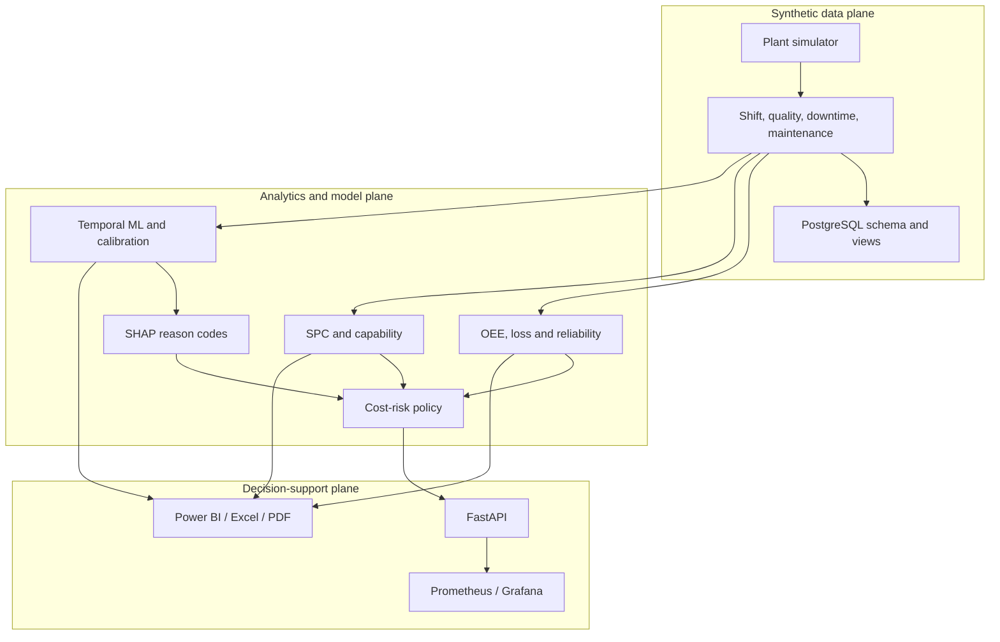

# Architecture

## Design goal

Provide a reproducible manufacturing decision-support reference that separates
analytical evidence, model risk and human authority.

## Trust boundaries

| Boundary | Allowed | Explicitly excluded |
|---|---|---|
| Source | Synthetic CSV generation and validated API input | Production historians, PII, credentials |
| Model | Probability and SHAP reason codes | Autonomous control commands |
| Policy | Recommendation priority and economic context | Work-order creation and approval |
| Service | Read-only model bundle and `/metrics` | PLC, SCADA and CMMS write access |
| Reporting | Snapshot analysis and governance evidence | Claims of real plant savings |

## Deployment profiles

- Local: Python pipeline and FastAPI.
- Integrated demo: Docker Compose with PostgreSQL, Prometheus and Grafana.
- Kubernetes reference: non-root, read-only filesystem, dropped capabilities,
  health probes, HPA, PDB and NetworkPolicy.

## Data flow

1. Seeded simulator emits three eight-hour shifts per machine and CTQ subgroups.
2. KPI layer reconciles counts, minutes and synthetic costs.
3. SPC limits are fit on development baseline data and applied forward.
4. Model fit, calibration, validation and OOT periods remain chronological.
5. Validation selects the champion and risk threshold; OOT is evaluated once.
6. Policy combines probability, criticality, costs and SHAP reason codes.
7. Human review remains mandatory before any maintenance action.

